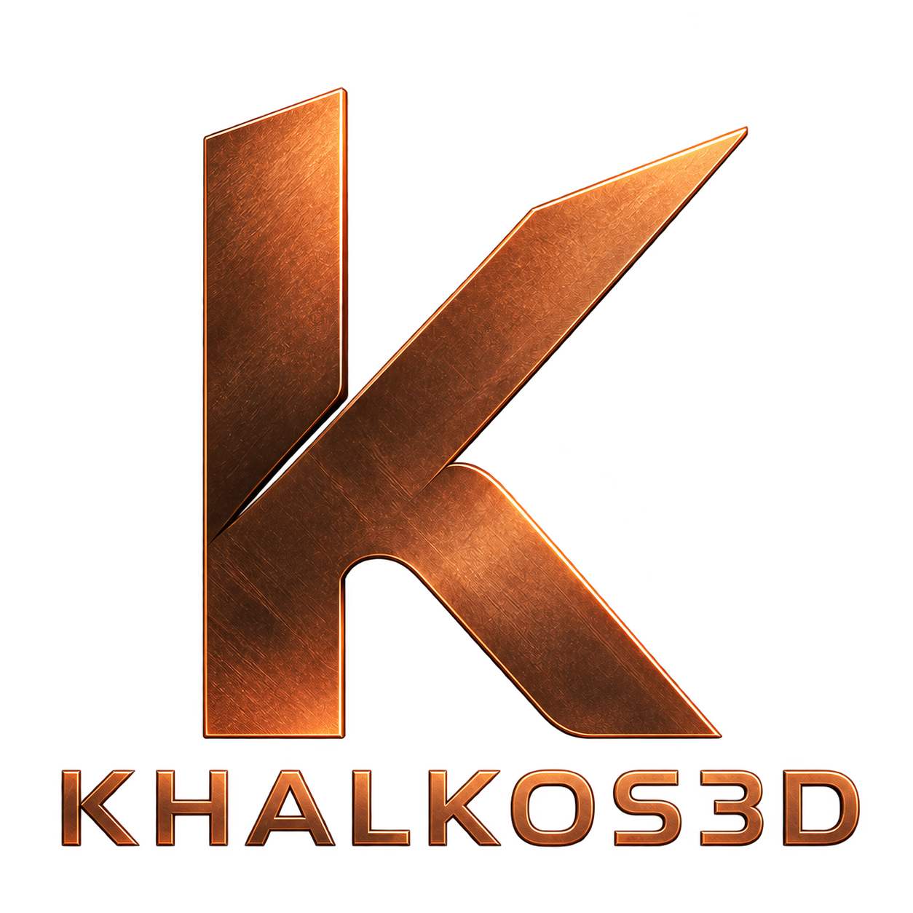

<p align="center">
  
</p>

# Khalkos3D

A small, managed-first 3D engine for .NET. Load models, render them anywhere.

```csharp
var scene = ModelReader.ReadFile("bracket.stl");

Console.WriteLine($"{scene.TriangleCount:N0} triangles, {scene.Bounds}");
if (scene.Report.Summary is { } warning) Console.WriteLine(warning);
```

**Status: the asset layer and the renderer both work and are tested against a real driver.** See
[the plan](docs/PLAN.md) for what is next.

---

## What it is

An engine for **basic 3D that has to run everywhere**: model viewers, inspection tools, light
animation, anything that needs geometry on screen inside an application. Windows, Linux, macOS,
Android, iOS and the browser, from one codebase and one shader source.

It is deliberately not a game engine. There is no ECS, no physics, no editor, no asset pipeline. If
you need those, Godot and Stride are excellent and free. This is for the case where you want a model
on screen inside an application you are already writing, and you do not want to adopt someone's
entire world to get it.

## What works today

| | |
|---|---|
| **`Khalkos3D.Core`** | `Mesh`, `Material`, `Scene`, `BoundingBox`, `Camera`, and the vertex welder |
| **`Khalkos3D.Formats`** | STL, OBJ, 3MF and glTF 2.0 / GLB, all producing the same `Scene` |
| **`Khalkos3D.Gl`** | draws it — desktop GL 3.3, OpenGL ES 3.0 and WebGL2 from one shader source, yours or its own |

**All three have zero dependencies.** Nothing outside the BCL, so the asset layer compiles for every
target including WebAssembly — where a native parser would mean a per-platform build matrix for what
is, in the end, reading bytes — and the renderer creates no window and no context, so it embeds
wherever there is already one.

```csharp
// The renderer is handed a proc-address function and draws into whatever framebuffer is bound.
var renderer = GlRenderer.Create(getProcAddress, out var error);

var view = new OrbitController();
view.Frame(scene, aspect: (float)width / height);   // takes the up axis from the file
renderer?.Draw(scene, view.Camera, width, height);

// Drags, pans and wheel ticks are fractions of the viewport, so a gesture feels the same on a
// phone and on a 4K monitor.
view.Orbit(dx / width, dy / height);
view.Zoom(wheelTicks);
```

Plus the scenery a viewer needs — a ground grid, a bounded work area and an RGB axis marker — and the
debug views that make a bad mesh obvious: wireframe, normals, and **backface highlighting**, which
matters because the shader deliberately flips normals towards the viewer so an inverted facet does not
appear as a black hole in geometry that is otherwise fine. That kindness hides the defect; this is how
you see it.

### It tells you what a mesh actually is

```csharp
var report = MeshAnalysis.Analyse(scene);
Console.WriteLine(report);
// 4,032 triangles, 0.1 x 0.05 x 0.06, 128 boundary edges

if (MeshAnalysis.ExceedsLimits(scene.Bounds, new Vector3(220, 220, 250)) is { } tooBig)
    Console.WriteLine(tooBig);
```

Volume, surface area, and whether the surface is a **closed, consistently oriented manifold** — the
property that volume, inside/outside tests, boolean operations and offsetting all quietly assume.
When it is not, you get which of the three irregularities applies: boundary edges, non-manifold
edges, or inconsistent winding. Plus inversion, detected from the *sign* of the volume, because an
inverted mesh is a perfectly good closed manifold and looks correct from outside.

It is a diagnostic, not a judgement: an open surface is a defect in something meant to enclose a
volume and completely correct in a terrain or a cloth, so it reports what the geometry **is** and
leaves the meaning to you.

Topology is computed on positions rather than indices, which matters more than it sounds: a
render-ready mesh has extra vertices at every hard edge, so matching by index would report every edge
of a sound cube as a boundary.

**Cross-section** cuts through a model so you can see wall thickness and internal structure —
`bounds.SectionAt(direction, 0.5f)` gives a plane a slider can drive without knowing the model's
scale.

### Materials look like materials

Metallic-roughness PBR with textures, per-texture sampler state, normal maps (tangents derived when a
file does not supply them), and an **environment** — because a metal has no diffuse colour at all, so
with nothing to reflect it correctly renders near-black and every user reads that as a broken shader.

The environment is a sky/horizon/ground gradient rather than an image: no HDR decoder, no
precomputation, no asset to ship, no per-platform texture format, and identical on all six targets.

**Up to eight lights**, directional or point, in any mix:

```csharp
var settings = RenderSettings.Default with
{
    Lights =
    [
        Light.Directional(new Vector3(-0.4f, -0.8f, -0.5f), new Vector3(2.6f)),   // the key
        Light.Point(furnace, new Vector3(9f, 3.8f, 0.9f), range: 6.5f),           // a lamp in the scene
    ],
};
```

Leave `Lights` empty and you get the single key light from `LightDirection` and `LightColor`, exactly
as before — filling it in replaces that light rather than adding to it, so a scene lit entirely by its
own lamps is possible. Point lights fall off by inverse square, windowed so they reach zero at their
range instead of touching every fragment in the scene forever. Past `Light.Max` the extras are
dropped in the order you gave them, because only you know whether that order should be distance,
brightness, or what the picture is about.

The cost of the ones you do not use is the uniform slots they reserve: the shader loops to the count,
not to the array size, so two lights do two lights' work. **And a surface shader written before any of
this gets every light for free** — a hook sets the base colour and the roughness, and how many lights
are summed afterwards is none of its business.

### You can write the shader

Materials are metallic-roughness PBR out of the box. When that is not the surface you wanted, hand the
engine GLSL of your own — and it still runs on all six targets, because the parts that differ between
them are the parts you do not write.

```csharp
// A surface shader: your function, the engine's program around it.
var bands = Shader.Surface("""
    uniform float uTime;
    uniform vec3  uGlow;

    void surface(inout Surface s) {
        float band = smoothstep(0.55, 0.97, sin((s.world.y - uTime * 0.55) * 17.0));
        s.baseColor.rgb = mix(s.baseColor.rgb, uGlow, band * 0.55);
        s.emissive = uGlow * band * 0.75;
    }
    """, name: "bands");

var material = new Material
{
    BaseColor = new Vector4(0.20f, 0.45f, 0.85f, 1f),
    Shader = bands,
    ShaderValues = new Dictionary<string, ShaderValue> { ["uTime"] = seconds, ["uGlow"] = glow },
};
```

No `#version`, no `in`/`out`, no lighting, no tone mapping: `Surface` arrives with the material
already resolved — base colour with its texture and vertex colour applied, the world normal with its
normal map applied — and whatever you leave in it gets lit. It carries the position in **both** world
and object space, because a procedural pattern belongs to the thing it is on: grain keyed to the room
would swim across the surface as the model turned. **W**, **N** and **B** keep working over
your material, because the debug views are in the program you did not have to write.

When you want the whole thing instead, `Shader.Program(vertex, fragment)` gives you both stages; the
engine contributes the version line and the attribute bindings and nothing else. That is the escape
hatch, and it hands back the portability guarantee on purpose.

**The driver in front of you is the wrong judge of whether your shader is portable.** A desktop GL
compiler takes `texture2D`, `varying` and `gl_FragColor` under its compatibility rules; ES 3.0 and
WebGL2 reject all three, so source like that works on the machine it was written on and fails on a
phone months later. `ShaderCheck.Inspect` reads the text and refuses what cannot be right everywhere —
before any driver sees it, with no GL context needed, so your own CI can run it on a machine with no
GPU. Desktop-only constructs are reported rather than refused, in notes you can print.

```csharp
var report = ShaderCheck.Inspect(bands);     // no context, no GPU, no window
if (!report.Ok) Console.Error.WriteLine(report.Error);
foreach (var note in report.Notes) Console.WriteLine(note);
```

A shader that will not build draws with the built-in program and says why, rather than taking the
frame with it — `GlRenderer.Prepare(shader)` returns the same report whenever you want it. Programs
are compiled once and cached against the `Shader` object by reference, so build one and hold it.

```csharp
// Every format, one type, and the caller never learns which parser ran.
Scene fromPrinter = StlReader.ReadFile("part.stl");        // welded, sharp edges kept sharp
Scene fromSlicer  = ThreeMfReader.ReadFile("plate.3mf");   // units converted to millimetres
Scene fromBlender = GltfReader.ReadFile("scene.glb");      // PBR materials, node hierarchy
Scene whatever    = ModelReader.ReadFile("mystery.dat");   // sniffed from the bytes
```

### Three things it does that most loaders do not

**Welding that keeps corners sharp.** An STL has no shared vertices — a box arrives as 36 vertices
rather than 8, and a million-triangle model as three million. Welding them naively then averaging
the normals rounds off every corner, which is exactly wrong for mechanical parts. So the merge is
conditional on the angle between the faces: a box stays faceted, a tessellated cylinder goes smooth,
one pass and no per-model tuning.

**Units.** A 3MF says whether it means millimetres or inches; this converts to millimetres so a build
volume or a measurement is written once. An STL cannot say, and that is worth knowing about STL.

**It tells you what it could not do.** Every load returns a `LoadReport` listing features that were
in the file and are not in the result:

```csharp
foreach (var note in scene.Report.Notes) Console.WriteLine(note);
// Unsupported: animations — the file has 2 animation(s); the model is shown in its rest pose
// Info: welding — 2,904,000 to 486,102 vertices (83% smaller), 12,044 kept sharp
```

A viewer that silently drops an animation track and shows a T-posed character has told its user
their file is broken when it is not. Where a feature changes how the *bytes* are encoded — Draco,
meshopt, quantisation — loading **throws** instead, because a half-decoded mesh is not a degraded
result but a wrong one.

## The demo

A standalone viewer for Windows, Linux, macOS and Android.

```
dotnet run --project samples/Khalkos3D.DesktopDemo              # the built-in scene
dotnet run --project samples/Khalkos3D.DesktopDemo -- model.glb # or any file it reads
```

Or open the folder in VS Code and press **F5** — the checked-in launch configurations run the
showcase, a path you type, or the model file open in the editor, and `Tasks: Run Task` carries the
tests and the Android install for a connected device.

Drag to orbit, right-drag or shift-drag to pan, wheel to zoom. **W** wireframe, **N** normals,
**B** highlight back-faces, **R** reset the view. On Android the same gestures apply: one finger
orbits, two pinch and pan.

The default scene is the logo above, turning, with metal spheres and dielectric cubes orbiting and
spinning around it on two counter-rotating rings. It is chosen because it **fails visibly**: a single
static object looks right under almost any broken shader, whereas the orbiting bodies sweep roughness
from near-mirror to nearly matte, so if the lighting maths is wrong the sweep stops varying, if the
environment is missing the metals go black, and if normals are inverted everything lights from the
wrong side. One screen tells you whether the renderer works on your machine.

The logo is the real `.github/assets/Khalkos3D.stl`, embedded in the shared sample and read through
`StlReader` on every launch rather than built in code — a sample for an asset layer should open an
asset. The spheres and cubes are generated and come out as closed manifolds, which `MeshAnalysis`
will confirm: a sample for an engine that ships a watertightness check should not hand it geometry
that fails.

**The animation is in the shared half too.** A moving scene here is a node tree rebuilt per frame
from the time, and the meshes handed over are the same objects each time — so the renderer's buffers
are cached by reference and nothing is re-uploaded. That is why an engine with no animation system,
no scene-graph mutation and no update loop can still show something moving, and why the hosts gained
not one line for it: `DemoViewer` keeps the clock.

**The logo and the cubes both carry shaders the sample supplies**, and they are there to be checked
rather than admired: the desktop app prints whether they compiled and the Android app logs it, so the
same lines are known to build on a desktop GL compiler and on a phone's GLES one — which are different
compilers, and the reason "it runs everywhere" is a claim worth testing rather than asserting. The K
is brushed copper, its grain in the model's own space so it stays on the metal as it turns; the cubes
are iron heated until it glows, breathing between dull red and nearly white.

**The cubes are also lights.** Each is a point light at its own position, coloured by the same heat
value its shader is given — one number, so the glow you see and the light it throws can never disagree
— and what they illuminate is everything else in the scene, including a logo whose custom shader
knows nothing about them.

### Where the code lives, which is the point

| | |
|---|---|
| `samples/Khalkos3D.Demo` | The scene, the camera, the lighting, the debug views, the gesture arithmetic. No window, no windowing library, no image codec. |
| `samples/Khalkos3D.DesktopDemo` | A Silk.NET window, a mouse and a keyboard. |
| `samples/Khalkos3D.AndroidDemo` | An activity, a `GLSurfaceView`, and touch. |

The shared project is the large one and the hosts are thin, which is the claim being demonstrated
rather than a tidiness preference. Android contributes about fifteen lines of real platform code:
`NativeLibrary.TryLoad("libGLESv3.so")` and exported-symbol lookup, deliberately **not**
`eglGetProcAddress` — some drivers return a non-null stub for any name asked of it, which makes a
missing entry point look present and then crash on the call.

Silk.NET is a *sample* dependency. Nothing under `src/` references it, which the `dependencies` CI
job asserts on every run — that is what lets the engine be driven from a host that already owns its
own window.

An installable arm64 APK is built on every CI run and attached to it as an artifact. It is signed
with a debug key that changes per build, so uninstall any previous copy before sideloading a new one
or Android will refuse it as a signature mismatch.

## Licensing

MIT, and it intends to stay that way. Dependencies are held to a policy: permissive only, nothing
that would force a licence change on anyone who uses this. See [docs/LICENSING.md](docs/LICENSING.md).

Today the count is zero. `Core`, `Formats` and `Gl` all use nothing but the BCL — the renderer's GL
entry points are function pointers resolved from a delegate the host supplies, not a binding library.

## Using it with CupriFace

[CupriFace](https://github.com/Wixely/CupriFace) is an HTML/CSS UI engine with a `CupriFace.Gl`
package that binds a GL viewport to a page element on every host. Its `IGlContent` interface hands
over a proc-address function and a size, which is exactly what `GlRenderer` wants — so the glue is
about thirty lines.

**Neither library depends on the other, and the glue lives in CupriFace's repository rather than
here** — a general-purpose engine depending on a UI toolkit would invert the direction.

It shipped: CupriFace's Showcase now draws its 3D viewport through this engine on all three of its
hosts, referencing it as a package. Each of the three lanes is evidenced on a different driver —
zero-copy shared-texture on desktop GL, GLES 3.0 through the Android device gate, and WebGL2 in
Chromium — with the engine and the toolkit independently parsing `GL_VERSION` and agreeing on the
dialect every time. See [the plan](docs/PLAN.md#cupriface).

## Building

```
dotnet build Khalkos3D.slnx
dotnet test tests/Khalkos3D.Tests          # no GPU needed; runs anywhere
dotnet test tests/Khalkos3D.RenderTests    # needs a GL context (xvfb-run on a headless Linux box)
```

Requires the .NET 10 SDK. Warnings are errors.

The two test projects are separate on purpose: the first must run on any machine, including one with
no GL at all, and merging them would make the fast portable suite unrunnable wherever the
driver-bound one cannot start.
